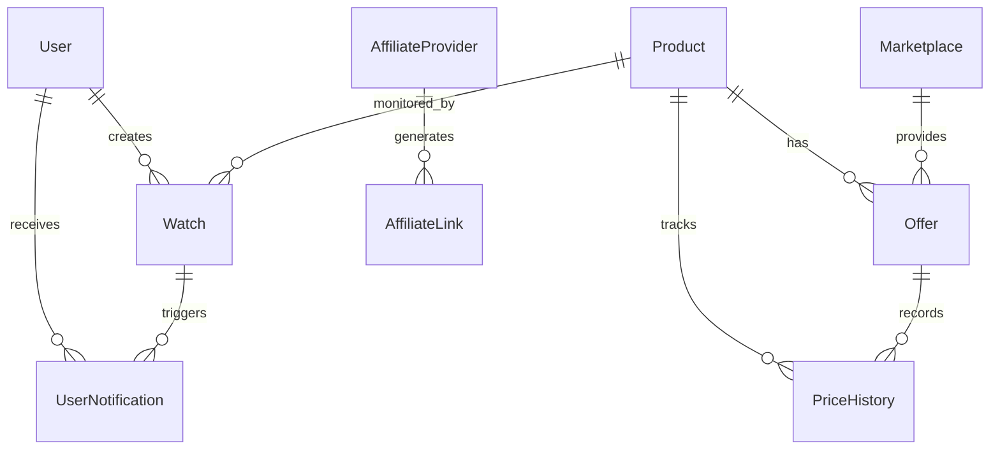

# Price Watch - 데이터베이스 설계 (ERD)

## 개요

이 문서는 Price Watch 서비스의 데이터베이스 구조와 관계를 설명합니다.

## 데이터베이스 스키마

### 핵심 엔티티



## 테이블 상세 구조

### 1. 사용자 관리 (User Management)

#### `users_user`
```sql
CREATE TABLE users_user (
    id BIGSERIAL PRIMARY KEY,
    username VARCHAR(150) UNIQUE NOT NULL,
    email VARCHAR(254) UNIQUE NOT NULL,
    password VARCHAR(128) NOT NULL,
    first_name VARCHAR(150),
    last_name VARCHAR(150),
    is_active BOOLEAN DEFAULT TRUE,
    is_staff BOOLEAN DEFAULT FALSE,
    is_superuser BOOLEAN DEFAULT FALSE,
    date_joined TIMESTAMP WITH TIME ZONE DEFAULT NOW(),
    last_login TIMESTAMP WITH TIME ZONE,
    notification_preferences JSONB DEFAULT '{"email": true, "push": false, "sms": false}'
);
```

#### `users_userprofile`
```sql
CREATE TABLE users_userprofile (
    id BIGSERIAL PRIMARY KEY,
    user_id BIGINT REFERENCES users_user(id) ON DELETE CASCADE,
    phone_number VARCHAR(20),
    address TEXT,
    preferred_marketplaces TEXT[],
    created_at TIMESTAMP WITH TIME ZONE DEFAULT NOW(),
    updated_at TIMESTAMP WITH TIME ZONE DEFAULT NOW()
);
```

### 2. 상품 관리 (Product Management)

#### `catalog_product`
```sql
CREATE TABLE catalog_product (
    id BIGSERIAL PRIMARY KEY,
    name VARCHAR(500) NOT NULL,
    brand VARCHAR(100),
    model_code VARCHAR(100),
    gtin VARCHAR(50) UNIQUE,
    specifications JSONB,
    image_url TEXT,
    description TEXT,
    category_id BIGINT REFERENCES catalog_category(id),
    is_active BOOLEAN DEFAULT TRUE,
    created_at TIMESTAMP WITH TIME ZONE DEFAULT NOW(),
    updated_at TIMESTAMP WITH TIME ZONE DEFAULT NOW()
);

CREATE INDEX idx_product_brand ON catalog_product(brand);
CREATE INDEX idx_product_model_code ON catalog_product(model_code);
CREATE INDEX idx_product_gtin ON catalog_product(gtin);
CREATE INDEX idx_product_category ON catalog_product(category_id);
```

#### `catalog_category`
```sql
CREATE TABLE catalog_category (
    id BIGSERIAL PRIMARY KEY,
    name VARCHAR(100) NOT NULL,
    parent_id BIGINT REFERENCES catalog_category(id),
    slug VARCHAR(100) UNIQUE NOT NULL,
    description TEXT,
    created_at TIMESTAMP WITH TIME ZONE DEFAULT NOW()
);
```

#### `catalog_productmapping`
```sql
CREATE TABLE catalog_productmapping (
    id BIGSERIAL PRIMARY KEY,
    product_id BIGINT REFERENCES catalog_product(id) ON DELETE CASCADE,
    marketplace_id VARCHAR(50) NOT NULL,
    external_id VARCHAR(100),
    external_url TEXT,
    last_synced_at TIMESTAMP WITH TIME ZONE,
    created_at TIMESTAMP WITH TIME ZONE DEFAULT NOW()
);
```

### 3. 오퍼 관리 (Offer Management)

#### `catalog_offer`
```sql
CREATE TABLE catalog_offer (
    id BIGSERIAL PRIMARY KEY,
    product_id BIGINT REFERENCES catalog_product(id) ON DELETE CASCADE,
    marketplace_id VARCHAR(50) NOT NULL,
    seller VARCHAR(200),
    price DECIMAL(10,2) NOT NULL,
    shipping_fee DECIMAL(10,2) DEFAULT 0,
    coupon_hint TEXT,
    availability_status VARCHAR(50) DEFAULT 'in_stock',
    url TEXT NOT NULL,
    affiliate_url TEXT,
    fetched_at TIMESTAMP WITH TIME ZONE DEFAULT NOW(),
    created_at TIMESTAMP WITH TIME ZONE DEFAULT NOW(),
    updated_at TIMESTAMP WITH TIME ZONE DEFAULT NOW()
);

CREATE INDEX idx_offer_product ON catalog_offer(product_id);
CREATE INDEX idx_offer_marketplace ON catalog_offer(marketplace_id);
CREATE INDEX idx_offer_price ON catalog_offer(price);
CREATE INDEX idx_offer_fetched_at ON catalog_offer(fetched_at);
```

#### `catalog_marketplace`
```sql
CREATE TABLE catalog_marketplace (
    id VARCHAR(50) PRIMARY KEY,
    name VARCHAR(100) NOT NULL,
    logo_url TEXT,
    base_url TEXT,
    is_active BOOLEAN DEFAULT TRUE,
    api_config JSONB,
    last_sync_at TIMESTAMP WITH TIME ZONE,
    created_at TIMESTAMP WITH TIME ZONE DEFAULT NOW()
);
```

### 4. 가격 히스토리 (Price History)

#### `catalog_pricehistory`
```sql
CREATE TABLE catalog_pricehistory (
    id BIGSERIAL PRIMARY KEY,
    offer_id BIGINT REFERENCES catalog_offer(id) ON DELETE CASCADE,
    price DECIMAL(10,2) NOT NULL,
    shipping_fee DECIMAL(10,2) DEFAULT 0,
    total_price DECIMAL(10,2) NOT NULL,
    recorded_at TIMESTAMP WITH TIME ZONE DEFAULT NOW()
);

CREATE INDEX idx_pricehistory_offer ON catalog_pricehistory(offer_id);
CREATE INDEX idx_pricehistory_recorded_at ON catalog_pricehistory(recorded_at);
CREATE INDEX idx_pricehistory_price ON catalog_pricehistory(price);
```

### 5. 가격 감시 (Price Watch)

#### `alerts_watch`
```sql
CREATE TABLE alerts_watch (
    id BIGSERIAL PRIMARY KEY,
    user_id BIGINT REFERENCES users_user(id) ON DELETE CASCADE,
    product_id BIGINT REFERENCES catalog_product(id) ON DELETE CASCADE,
    target_price DECIMAL(10,2) NOT NULL,
    current_price DECIMAL(10,2),
    is_active BOOLEAN DEFAULT TRUE,
    notification_email BOOLEAN DEFAULT TRUE,
    notification_push BOOLEAN DEFAULT FALSE,
    created_at TIMESTAMP WITH TIME ZONE DEFAULT NOW(),
    updated_at TIMESTAMP WITH TIME ZONE DEFAULT NOW(),
    last_triggered_at TIMESTAMP WITH TIME ZONE
);

CREATE INDEX idx_watch_user ON alerts_watch(user_id);
CREATE INDEX idx_watch_product ON alerts_watch(product_id);
CREATE INDEX idx_watch_active ON alerts_watch(is_active);
CREATE INDEX idx_watch_target_price ON alerts_watch(target_price);
```

#### `alerts_usernotification`
```sql
CREATE TABLE alerts_usernotification (
    id BIGSERIAL PRIMARY KEY,
    user_id BIGINT REFERENCES users_user(id) ON DELETE CASCADE,
    watch_id BIGINT REFERENCES alerts_watch(id) ON DELETE CASCADE,
    notification_type VARCHAR(50) NOT NULL,
    title VARCHAR(200) NOT NULL,
    message TEXT NOT NULL,
    is_read BOOLEAN DEFAULT FALSE,
    sent_at TIMESTAMP WITH TIME ZONE DEFAULT NOW(),
    read_at TIMESTAMP WITH TIME ZONE
);

CREATE INDEX idx_notification_user ON alerts_usernotification(user_id);
CREATE INDEX idx_notification_watch ON alerts_usernotification(watch_id);
CREATE INDEX idx_notification_read ON alerts_usernotification(is_read);
```

### 6. 제휴 링크 (Affiliate Links)

#### `affiliate_affiliateprovider`
```sql
CREATE TABLE affiliate_affiliateprovider (
    id BIGSERIAL PRIMARY KEY,
    name VARCHAR(100) NOT NULL,
    marketplace_id VARCHAR(50) REFERENCES catalog_marketplace(id),
    api_key VARCHAR(200),
    api_secret VARCHAR(200),
    commission_rate DECIMAL(5,4),
    is_active BOOLEAN DEFAULT TRUE,
    created_at TIMESTAMP WITH TIME ZONE DEFAULT NOW()
);
```

#### `affiliate_affiliatelink`
```sql
CREATE TABLE affiliate_affiliatelink (
    id BIGSERIAL PRIMARY KEY,
    provider_id BIGINT REFERENCES affiliate_affiliateprovider(id),
    offer_id BIGINT REFERENCES catalog_offer(id) ON DELETE CASCADE,
    original_url TEXT NOT NULL,
    affiliate_url TEXT NOT NULL,
    click_count INTEGER DEFAULT 0,
    conversion_count INTEGER DEFAULT 0,
    created_at TIMESTAMP WITH TIME ZONE DEFAULT NOW()
);

CREATE INDEX idx_affiliatelink_provider ON affiliate_affiliatelink(provider_id);
CREATE INDEX idx_affiliatelink_offer ON affiliate_affiliatelink(offer_id);
```

#### `affiliate_clicktracking`
```sql
CREATE TABLE affiliate_clicktracking (
    id BIGSERIAL PRIMARY KEY,
    affiliate_link_id BIGINT REFERENCES affiliate_affiliatelink(id),
    user_id BIGINT REFERENCES users_user(id),
    ip_address INET,
    user_agent TEXT,
    referrer TEXT,
    clicked_at TIMESTAMP WITH TIME ZONE DEFAULT NOW()
);

CREATE INDEX idx_clicktracking_link ON affiliate_clicktracking(affiliate_link_id);
CREATE INDEX idx_clicktracking_user ON affiliate_clicktracking(user_id);
CREATE INDEX idx_clicktracking_clicked_at ON affiliate_clicktracking(clicked_at);
```

### 7. 시스템 관리 (System Management)

#### `core_auditlog`
```sql
CREATE TABLE core_auditlog (
    id BIGSERIAL PRIMARY KEY,
    user_id BIGINT REFERENCES users_user(id),
    action VARCHAR(100) NOT NULL,
    model_name VARCHAR(100),
    object_id BIGINT,
    changes JSONB,
    ip_address INET,
    user_agent TEXT,
    created_at TIMESTAMP WITH TIME ZONE DEFAULT NOW()
);

CREATE INDEX idx_auditlog_user ON core_auditlog(user_id);
CREATE INDEX idx_auditlog_action ON core_auditlog(action);
CREATE INDEX idx_auditlog_created_at ON core_auditlog(created_at);
```

#### `core_systemsetting`
```sql
CREATE TABLE core_systemsetting (
    id BIGSERIAL PRIMARY KEY,
    key VARCHAR(100) UNIQUE NOT NULL,
    value TEXT,
    description TEXT,
    is_public BOOLEAN DEFAULT FALSE,
    created_at TIMESTAMP WITH TIME ZONE DEFAULT NOW(),
    updated_at TIMESTAMP WITH TIME ZONE DEFAULT NOW()
);
```

## 인덱스 전략

### 성능 최적화를 위한 복합 인덱스

```sql
-- 상품 검색 최적화
CREATE INDEX idx_product_search ON catalog_product(brand, model_code, is_active);

-- 오퍼 가격 비교 최적화
CREATE INDEX idx_offer_price_comparison ON catalog_offer(product_id, marketplace_id, price, fetched_at);

-- 가격 감시 알림 최적화
CREATE INDEX idx_watch_notification ON alerts_watch(user_id, is_active, target_price);

-- 가격 히스토리 분석 최적화
CREATE INDEX idx_pricehistory_analysis ON catalog_pricehistory(offer_id, recorded_at, price);
```

## 데이터 파티셔닝

### 가격 히스토리 테이블 파티셔닝

```sql
-- 월별 파티셔닝
CREATE TABLE catalog_pricehistory_2024_01 PARTITION OF catalog_pricehistory
FOR VALUES FROM ('2024-01-01') TO ('2024-02-01');

CREATE TABLE catalog_pricehistory_2024_02 PARTITION OF catalog_pricehistory
FOR VALUES FROM ('2024-02-01') TO ('2024-03-01');
```

## 외래 키 제약 조건

```sql
-- CASCADE 삭제 설정
ALTER TABLE catalog_offer 
ADD CONSTRAINT fk_offer_product 
FOREIGN KEY (product_id) REFERENCES catalog_product(id) ON DELETE CASCADE;

-- SET NULL 설정 (사용자 삭제 시 감시 기록은 유지)
ALTER TABLE alerts_watch 
ADD CONSTRAINT fk_watch_user 
FOREIGN KEY (user_id) REFERENCES users_user(id) ON DELETE SET NULL;
```

## 데이터 무결성 제약 조건

```sql
-- 가격은 양수여야 함
ALTER TABLE catalog_offer 
ADD CONSTRAINT check_positive_price CHECK (price > 0);

-- 목표 가격은 현재 가격보다 낮아야 함
ALTER TABLE alerts_watch 
ADD CONSTRAINT check_target_price CHECK (target_price < current_price);

-- 알림 타입은 유효한 값이어야 함
ALTER TABLE alerts_usernotification 
ADD CONSTRAINT check_notification_type 
CHECK (notification_type IN ('email', 'push', 'sms'));
```

## 백업 및 복구 전략

### 자동 백업 설정

```sql
-- PostgreSQL 논리적 백업
-- pg_dump을 사용한 일일 백업
-- WAL 아카이빙을 통한 Point-in-Time Recovery

-- Redis 백업
-- RDB 스냅샷 + AOF 로그
-- 클러스터 모드에서의 복제본 관리
```

## 모니터링 및 성능

### 성능 모니터링 쿼리

```sql
-- 느린 쿼리 모니터링
SELECT query, calls, total_time, mean_time
FROM pg_stat_statements 
ORDER BY mean_time DESC 
LIMIT 10;

-- 인덱스 사용률 모니터링
SELECT schemaname, tablename, indexname, idx_scan, idx_tup_read, idx_tup_fetch
FROM pg_stat_user_indexes 
ORDER BY idx_scan DESC;
```

## 마이그레이션 전략

### Django 마이그레이션

```bash
# 개발 환경
python manage.py makemigrations
python manage.py migrate

# 프로덕션 환경
python manage.py migrate --plan
python manage.py migrate
```

### 데이터 마이그레이션

```python
# Django 데이터 마이그레이션 예시
from django.db import migrations

def migrate_product_specifications(apps, schema_editor):
    Product = apps.get_model('catalog', 'Product')
    for product in Product.objects.all():
        if product.specifications_text:
            # 기존 텍스트 형식 스펙을 JSON으로 변환
            product.specifications = parse_specifications(product.specifications_text)
            product.save()

class Migration(migrations.Migration):
    dependencies = [
        ('catalog', '0001_initial'),
    ]
    
    operations = [
        migrations.RunPython(migrate_product_specifications),
    ]
```
